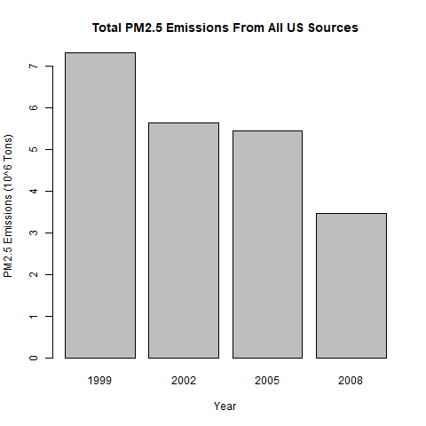
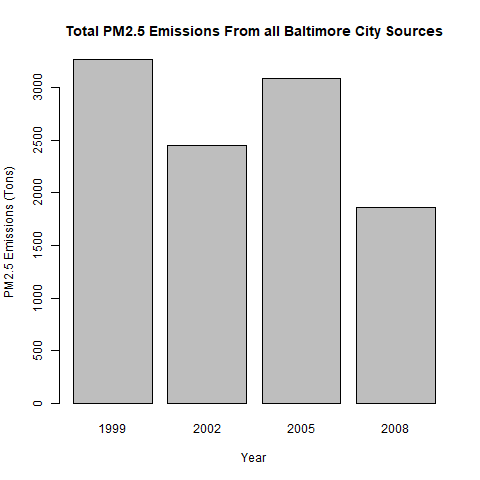
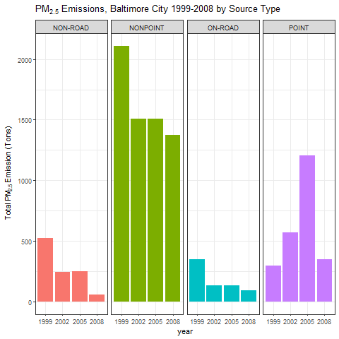
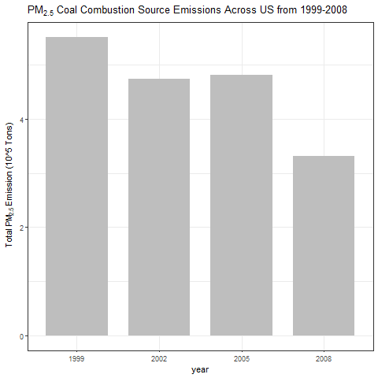
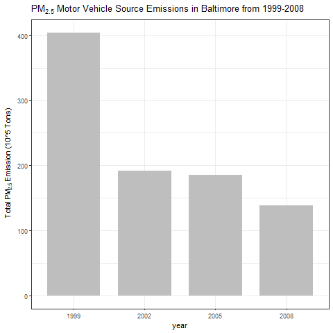
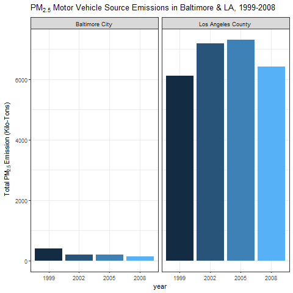

@@ -107,11 +107,12 @@ barplot(
    main="Total PM2.5 Emissions From All US Sources"
  )
  ```
 -
  **Have total emissions from PM2.5 decreased in the United States from 1999 to 2008?**
  
  As we can see from the plot, total emissions have decreased in the US from 1999 to 2008.
  
 +
 +
  ### Question 2
  
  First we aggregate total emissions from PM2.5 for Baltimore City, Maryland (fips="24510") from 1999 to 2008.
 @@ -137,6 +138,8 @@ barplot(
  
  Overall total emissions from PM2.5 have decreased in Baltimore City, Maryland from 1999 to 2008.
  
 +
 +
  ### Question 3
  
  Using the ggplot2 plotting system,
 @@ -162,7 +165,7 @@ The `non-road`, `nonpoint`, `on-road` source types have all seen decreased emiss
  
  The `point` source saw a slight increase overall from 1999-2008. Also note that the `point` source saw a significant increase until 2005 at which point it decreases again by 2008 to just above the starting values. 
  
 -(Note that I did not catch this originally as I started off with a log scale on Emissions)
 +
  
  ### Question 4
  
 @@ -197,6 +200,8 @@ Emissions from coal combustion related sources have decreased from 6 * 10^6 to b
  
  Eg. Emissions from coal combustion related sources have decreased by about 1/3 from 1999-2008!
  
 +
 +
  ### Question 5
  
  First we subset the motor vehicles, which we assume is anything like Motor Vehicle in SCC.Level.Two.
 @@ -225,6 +230,7 @@ ggp <- ggplot(baltimoreVehiclesNEI,aes(factor(year),Emissions)) +
  
  print(ggp)
  ```
 +
  
  **How have emissions from motor vehicle sources changed from 1999–2008 in Baltimore City?**
  
 @@ -260,3 +266,5 @@ print(ggp)
  **Which city has seen greater changes over time in motor vehicle emissions?**
  
  Los Angeles County has seen the greatest changes over time in motor vehicle emissions.
 +
 +
